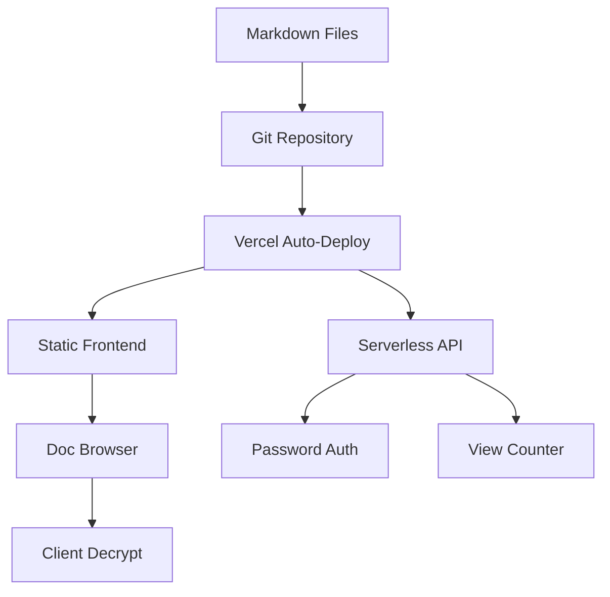
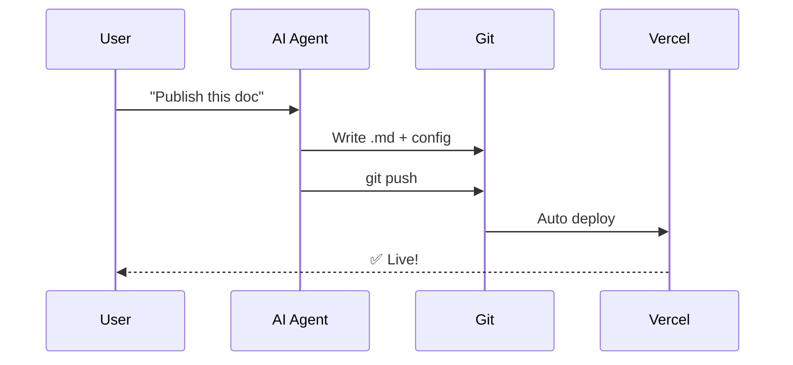
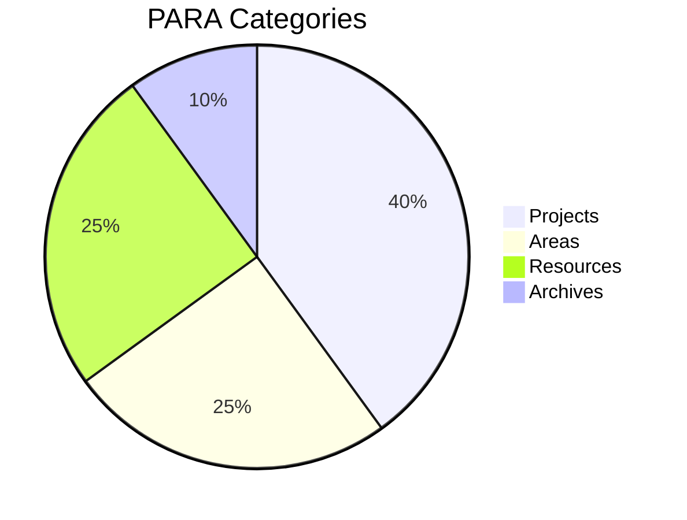

# 🎨 PawPrint Feature Demo

This document showcases PawPrint's rendering capabilities.

## Code Syntax Highlighting

### JavaScript

```javascript
async function publishDoc(slug, content, options = {}) {
  const config = await readConfig();
  config.docs.push({ slug, ...options });
  await writeConfig(config);
  await gitPush(`docs: add ${slug}`);
}
```

### Python

```python
class PawPrintClient:
    def __init__(self, repo_path: str):
        self.repo = repo_path
    
    def publish(self, title: str, content: str, category: str = "resources"):
        slug = title.lower().replace(" ", "-")
        filepath = f"docs/{category}/{slug}.md"
        with open(f"{self.repo}/{filepath}", "w") as f:
            f.write(content)
        print(f"✅ Published: {slug}")
```

### Bash

```bash
#!/bin/bash
SLUG="$1"
cd /path/to/pawprint
echo "# $SLUG" > "docs/resources/$SLUG.md"
git add -A && git commit -m "docs: add $SLUG" && git push
```

## Mermaid Diagrams

### Architecture



### Publish Flow



### Document Categories



## Tables

| Feature | PawPrint | DocSend | Papermark |
|---------|---------|---------|-----------|
| AI Publish | ✅ | ❌ | ❌ |
| E2E Encrypt | ✅ | ❌ | ❌ |
| Zero Database | ✅ | ❌ | ❌ |
| Open Source | ✅ | ❌ | ✅ |
| Free | ✅ | ❌ | Freemium |

## Blockquote

> "When the cost of creating things approaches zero, trust becomes the scarcest resource."

---

🐾 **PawPrint** — Leave your mark.
