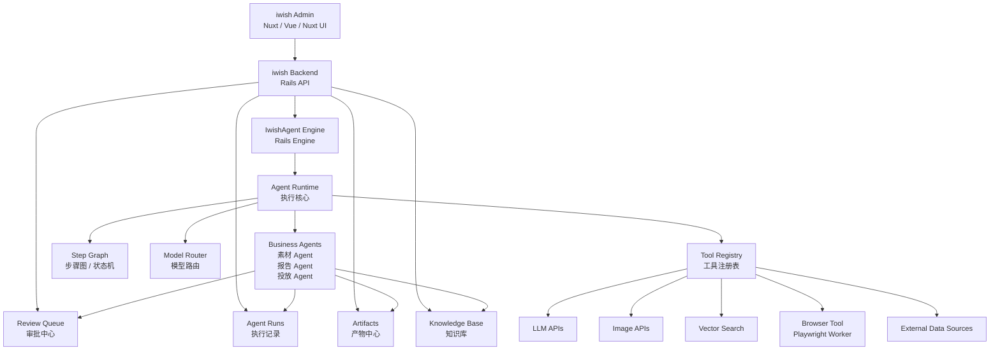
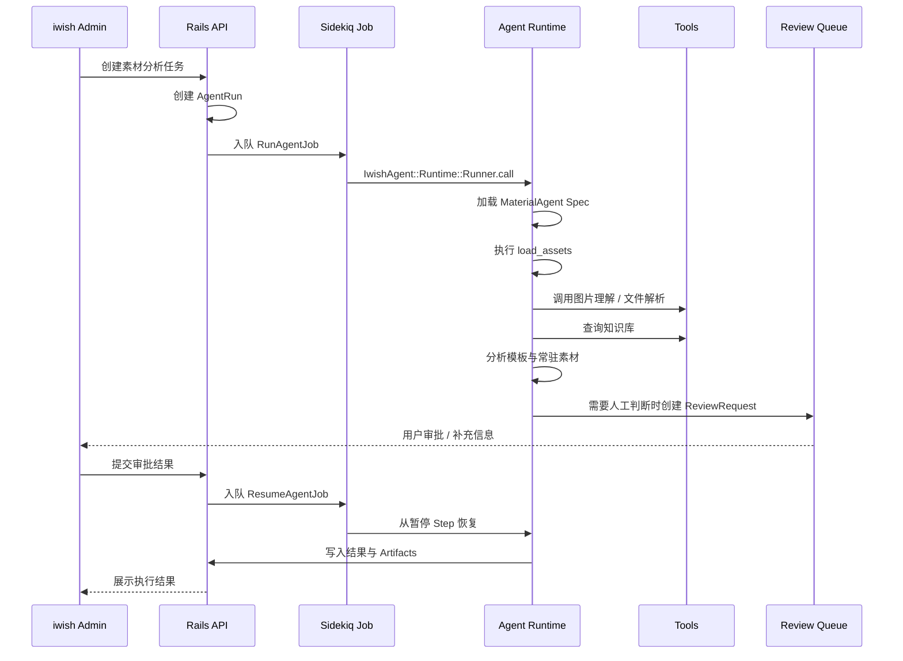

# iwish Agent 技术路线与系统边界方案

## 1. 文档定位

本文档是一份 `技术路线与系统边界方案`，不是纯 PRD，也不是单纯技术栈清单。

它用于回答：

- iwish 投流 Agent 系统应该放在 Rails 体系内，还是独立成 Agent Runtime 服务
- 素材 Agent、报告 Agent 到底是什么
- Agent 相关代码应该放在哪里
- 如果继续基于 Rails，如何解决复杂 Agent 图、浏览器自动化、AI 工具生态不足的问题
- 是否需要引入 OpenClaw、LangGraph、PaiAgent、Paperclip 等开源项目
- MVP 阶段如何落地，后续如何演进

本文档同时包含：

- 架构决策
- 产品边界
- 技术选型
- 代码组织建议
- MVP 路线
- 后续扩展方向

## 2. 核心结论

### 2.1 主路线：基于现有 iwish-server 建设 IwishAgent Engine

当前已经存在的系统是：

```text
~/beansmile/codes/iwish/iwish-server
```

它是 iwish 的 Rails 后端系统，已经承载了用户、权限、项目、客户、广告账户、投放数据同步、Shopify、GA4、Meta、Bing、Criteo 等一部分业务能力。

但这不等于 Agent 所需的业务模块都已经存在。Agent 体系需要在现有 `iwish-server` 上新增或扩展一套独立边界更清晰的 Rails Engine：

```text
iwish-server/engines/iwish_agent
```

这个 Engine 承载：

- Agent Runtime
- Agent Specs
- Agent Runs
- Agent Steps
- Agent Events
- Review Queue
- Artifacts
- Tool Calls
- Model Calls
- 素材分析结果
- 报告生成记录
- 知识库索引与检索能力

因此，当前更推荐的主路线是：

```text
iwish-server = 现有 Rails 业务系统
IwishAgent Engine = Agent 控制中心 + Agent 执行核心
Sidekiq = 后台异步执行
Tool Adapter = Rails 不擅长能力的外部工具入口
```

也就是说，MVP 和中期阶段不需要先拆出独立 Agent Runtime 服务。

推荐架构为：

```text
iwish Admin
  Nuxt / Vue / Nuxt UI
        |
        v
iwish Backend
  Rails API
  现有业务模型
  IwishAgent Engine
  Sidekiq
  Review Queue
  Agent Runs
  Artifacts
        |
        v
Tools / Connectors
  LLM
  图片理解
  生图模型
  知识库
  浏览器自动化
  文件处理
  外部数据源
```

一句话：

```text
Agent 主流程留在 Rails 体系内，但放进独立的 IwishAgent Engine；Rails 不擅长的能力，通过工具适配器补齐。
```

### 2.2 推荐 Engine，不建议一开始独立服务或独立 gem

独立 Agent Runtime 服务确实有长期价值，但立项初期直接拆分会带来额外成本：

- 多一套服务部署
- 多一套日志与监控
- 多一套错误排查链路
- Rails 与 Runtime 之间需要 API 协议
- Runtime 访问 Rails 数据需要 snapshot 或 API
- 业务状态容易分散

独立 gem 也不是当前最优先的形态。因为 Agent 抽象、业务输入输出、审批规则、素材与报告模型还没有稳定，过早 gem 化会带来：

- 抽象过早
- 适配层过多
- 调试成本更高
- migration、routes、jobs、models 处理更复杂
- 业务模型变化时 gem 接口频繁调整

当前 iwish 的核心挑战不是“缺少独立执行服务”，而是先在现有 `iwish-server` 中补齐 Agent 所需的业务与执行闭环：

- Agent 输入输出尚未完全稳定
- 素材 Agent 和报告 Agent 的业务边界仍在收敛
- 人工审批点还需要验证
- 知识库如何参与执行还需要沉淀
- 产物结构、报告结构、素材标签体系需要先跑通

因此，推荐先做：

```text
Rails Monolith with IwishAgent Engine
```

中文可以叫：

```text
Rails 单体内的 Agent Engine
```

### 2.3 后续不是不能 gem 化或拆服务，而是先把边界写对

虽然当前 Agent Runtime 仍然运行在 Rails 体系内，但代码结构要按“未来可 gem 化 / 可拆服务”的方式组织。

也就是：

```text
物理上：Agent 代码在 iwish-server/engines/iwish_agent 里
逻辑上：IwishAgent Engine 是独立子系统
```

未来如果 Agent 抽象稳定，可以先 gem 化：

```text
engines/iwish_agent
  -> internal gem
  -> private git gem
```

未来如果执行压力或技术栈差异继续扩大，再拆成独立服务：

```text
IwishAgent Engine
  -> 独立 Agent Runtime Service
```

Rails 继续保留：

```text
用户权限
业务对象
AgentRun
Review Queue
Artifacts
报告记录
素材记录
Admin API
```

这样未来演进是“抽离边界清晰的 Engine”，不是“从散落代码里重写一套 Agent 系统”。

## 3. 核心概念定义

### 3.1 Business Agent

iwish 中的 `素材 Agent / 报告 Agent / 投放 Agent` 都属于 Business Agent。

它不是大模型，也不是聊天窗口，而是：

```text
拥有 Agent Spec 的可执行业务工作流单元
```

完整结构为：

```text
Business Agent =
Agent Spec
+ Steps
+ Tools
+ Model Policy
+ Knowledge Access
+ Output Schema
+ Review Rules
+ Runtime Logs
```

例如，素材 Agent 不是“一个 LLM prompt”，而是：

```text
读取素材
识别素材类型
查询品牌知识库
分析模板与常驻元素
判断是否适合训练
生成素材建议
必要时提交人工审批
输出结构化结果
```

### 3.2 Agent Runtime

Agent Runtime 是执行 Business Agent 的运行层。

在 iwish 当前方案中，Agent Runtime 先放在 IwishAgent Engine 内部：

```text
engines/iwish_agent/app/services/iwish_agent/runtime
```

它负责：

- 加载 Agent Spec
- 创建 Agent Run
- 执行 Step
- 管理 Step 状态
- 调用工具
- 路由模型
- 写入日志
- 处理中断与恢复
- 创建 Review Request
- 保存 Artifacts

### 3.3 Agent Spec

Agent Spec 是 Business Agent 的说明书和契约。

它定义：

- Agent 名称
- 职责边界
- 输入 schema
- 输出 schema
- 执行步骤
- 可用工具
- 模型策略
- 知识库读写规则
- 审批触发条件
- 失败处理规则
- 成功指标

### 3.4 Step Graph

Step Graph 是 Rails 内部的轻量工作流图。

它不需要一开始引入 LangGraph 或 Temporal，而是先支持：

- 顺序执行
- 条件分支
- 失败重试
- 人工中断
- 恢复执行
- Step 日志
- Step 输入输出记录

示例：

```text
load_assets
  -> classify_assets
  -> retrieve_knowledge
  -> analyze_templates
  -> generate_recommendations
  -> maybe_review
  -> export_result
```

### 3.5 Tool Adapter

Tool Adapter 是 Rails 调用外部能力的统一入口。

Rails 不擅长的事情，不需要硬塞进 Rails，而是包装成工具：

```text
LLMTool
ImageUnderstandingTool
ImageGenerationTool
VectorSearchTool
BrowserTool
DashboardExportTool
FileParserTool
ReportWriterTool
```

Agent 主流程仍然在 Rails，外部能力只是工具。

### 3.6 Review Queue

Review Queue 是结构化审批队列。

它用于承接 Agent 执行过程中需要人工介入的节点，例如：

- 缺失数据是否允许估算
- 是否采用某类素材作为训练样本
- 是否发布报告
- 是否执行预算调整
- 是否继续访问外部系统

Review Queue 不应该做成普通聊天窗口，而应该有明确结构：

- 问题
- 背景
- Agent 推荐
- 可选操作
- 默认超时策略
- 审批人
- 审批结果
- 恢复执行入口

## 4. 推荐系统架构



这套架构的关键点：

- Rails 仍然是系统中心
- IwishAgent Engine 是 Rails 内部的独立子系统，不是第二套系统
- Sidekiq 负责异步执行长任务
- 复杂能力通过 Tool Adapter 调用
- Review Queue、Agent Runs、Artifacts 都归 Rails 管
- 后续可以先 gem 化 Engine，再按需要拆执行层，不迁移业务系统

## 5. Rails Engine 代码组织建议

建议代码结构：

```text
engines/iwish_agent/
  app/
    controllers/iwish_agent/
      agent_runs_controller.rb
      review_requests_controller.rb

    models/iwish_agent/
      agent_spec.rb
      agent_run.rb
      agent_step.rb
      agent_event.rb
      agent_artifact.rb
      review_request.rb
      tool_call.rb
      model_call.rb

    jobs/iwish_agent/
      run_agent_job.rb
      resume_agent_job.rb

    services/iwish_agent/
      runtime/
        runner.rb
        step_executor.rb
        step_graph.rb
        context.rb
        model_router.rb
        tool_registry.rb
        review_gate.rb
        artifact_writer.rb
        run_repository.rb

      agents/
        material_agent/
          spec.rb
          runner.rb
          steps/
            load_assets.rb
            classify_assets.rb
            retrieve_knowledge.rb
            analyze_templates.rb
            generate_recommendations.rb
            maybe_request_review.rb
            export_result.rb

        report_agent/
          spec.rb
          runner.rb
          steps/
            collect_data.rb
            normalize_data.rb
            retrieve_context.rb
            analyze_data.rb
            generate_report.rb
            request_review.rb
            export_report.rb

      tools/
        llm_tool.rb
        image_understanding_tool.rb
        image_generation_tool.rb
        vector_search_tool.rb
        browser_tool.rb
        dashboard_export_tool.rb
        file_parser_tool.rb

  config/
    routes.rb

  db/
    migrate/
```

主应用挂载 Engine：

```ruby
mount IwishAgent::Engine => "/agent"
```

Engine Controller 不直接执行 Agent，只负责创建任务：

```text
Admin 请求 Rails API
Rails 创建 AgentRun
Rails 入队 Sidekiq Job
Sidekiq 调用 IwishAgent::Runtime::Runner
Runner 执行 Agent Steps
Runner 写入 AgentStep / AgentEvent / Artifact
需要人工介入时创建 ReviewRequest
Admin 审批后 Resume Agent
```

Engine 访问主应用业务数据时，不建议在 Step 内直接调用 `Project.find`、`Customer.find` 或具体投放模型。

推荐通过 Host Adapter / Repository：

```text
IwishAgent Engine
  -> HostProjectRepository
  -> HostAssetRepository
  -> HostReportRepository
  -> Agent Input Snapshot
```

这样 Engine 既能复用主系统业务数据，又不会和主应用模型深度缠绕。

## 6. 如何解决 Rails 方案的三个短板

### 6.1 复杂 Agent 图

问题：

```text
Rails 没有 LangGraph 这类成熟 Agent 状态图框架。
```

解决：

先在 Rails 内实现轻量 `Step Graph`。

第一阶段只需要支持：

- 顺序步骤
- 条件分支
- Step 状态
- Step 输入输出
- 失败重试
- 人工审批暂停
- 从指定 Step 恢复

这已经可以覆盖报告 Agent 和素材 Agent 的大部分需求。

只有当出现以下情况，再考虑引入 LangGraph 或独立 Runtime：

- 多 Agent 复杂协作
- 大量循环推理
- 非常复杂的状态图
- 需要长期运行并强恢复
- 需要大量并发分支

### 6.2 浏览器自动化

问题：

```text
Rails 不适合直接承担复杂浏览器自动化。
```

解决：

浏览器能力做成 `Browser Tool`，而不是把整个 Agent 拆出去。

推荐形态：

```text
IwishAgent Engine Runtime
  -> Tools::BrowserTool
  -> Node Playwright Worker
  -> 外部系统页面
```

这里的 Node Playwright Worker 只是工具服务，不是 Agent 主系统。

它只负责：

- 登录外部平台
- 下载报表
- 截图
- 页面操作
- 返回结构化结果或文件地址

Rails 仍然负责：

- 谁发起任务
- 为什么要访问
- 访问结果属于哪个 AgentRun
- 是否需要审批
- 产物如何入库
- 后续 Step 如何继续

### 6.3 AI 工具生态

问题：

```text
Python 在 RAG、图像处理、模型评估、Agent 框架上生态更强。
```

解决：

Rails 不需要复制 Python 生态，而是通过 `Tool Adapter` 使用这些能力。

例如：

```text
Rails Agent
  -> VectorSearchTool
  -> pgvector / Qdrant

Rails Agent
  -> ImageUnderstandingTool
  -> OpenAI / Claude / Gemini 多模态 API

Rails Agent
  -> DataAnalysisTool
  -> Python micro tool

Rails Agent
  -> BrowserTool
  -> Playwright Worker
```

原则是：

```text
Agent 主流程在 Rails
专业能力作为 Tool
Tool 可替换
Tool 不拥有业务状态
```

这样既保留 Rails 系统统一性，又不会被 Ruby 生态限制住。

## 7. Agent 执行流程

以素材 Agent 为例：



重点：

- HTTP 请求只创建任务，不同步等待完整 Agent 执行
- 长任务由 Sidekiq 执行
- 每个 Step 有状态和日志
- 人工审批通过 Review Queue 中断和恢复
- 所有结果最终回到 Rails

## 8. Agent Center 设计方向

Agent 管理能力应该集成进 iwish Admin，而不是单独做一套 Agent Admin。

建议模块：

### 8.1 Agent Specs

管理业务 Agent 定义：

- 素材 Agent
- 报告 Agent
- 数据 Agent
- 投放 Agent
- 站点 Agent

### 8.2 Agent Runs

查看每一次 Agent 执行：

- 输入
- 输出
- 当前状态
- Step 列表
- 日志
- 使用模型
- 调用工具
- 生成产物
- 审批记录

### 8.3 Review Queue

处理 Agent 执行过程中的人工介入：

- 待审批
- 已通过
- 已驳回
- 已超时
- 已恢复执行

### 8.4 Artifacts

管理 Agent 生成的中间产物和最终产物：

- 素材标签
- 素材分析结果
- 报告草稿
- 报告 HTML / PDF
- 数据快照
- 图片理解结果
- 外部系统导出文件

### 8.5 Model Policy

配置不同步骤使用不同模型：

- 简单分类：低成本文本模型
- 图片理解：多模态模型
- 策略推理：高质量推理模型
- 报告生成：高质量文本模型
- 生图 / 改图：高质量图像模型

### 8.6 Tools / Connectors

管理工具和外部系统：

- LLM
- 图片模型
- Shopify
- GA4
- Meta Ads
- Google Ads
- 素材库
- OCR
- 浏览器自动化
- 知识库检索

## 9. 开源项目定位

### 9.1 LangGraph

定位：

```text
复杂 Agent 状态图框架
```

当前不建议直接引入为主 Runtime。

推荐用法：

```text
先在 Rails 内沉淀 Agent Spec、Step、Review、Artifact
如果后期某个 Agent 复杂到 Rails Step Graph 不够用
再针对该 Agent 引入 LangGraph
```

### 9.2 OpenClaw

定位：

```text
通用 Agent Runtime / 自动化执行器
```

推荐作为研究和原型工具，不建议作为 iwish 核心 Agent 系统。

适合：

- 快速验证某类自动化能力
- 辅助本地文件分析
- 借鉴工具调用思路

不适合：

- 管理 iwish 业务状态
- 直接控制投流预算
- 替代 Rails Review Queue

### 9.3 PaiAgent

定位：

```text
完整 AI 工作流可视化平台
```

不建议直接引入原因：

- 技术栈与 iwish 不一致
- Admin 重叠
- 用户权限重叠
- 数据模型重叠
- 投流业务对象难以自然对接

推荐用法：

```text
参考其 workflow UI、DAG、节点执行、SSE 输出设计
不作为 iwish 系统依赖
```

### 9.4 Paperclip

定位：

```text
多 Agent 治理 / 协作理念参考
```

可借鉴：

- Agent governance
- Audit log
- Cost control
- Ticket / Review 思路
- 多 Agent 协作边界

### 9.5 agency-agents

定位：

```text
Agent 角色库 / Prompt 参考
```

适合：

- 提炼投流 Agent 职责
- 编写 Agent Spec
- 借鉴 paid media 专家角色

不适合：

- 作为执行框架
- 作为工作流引擎

## 10. MVP 路线

### 10.1 阶段一：定义 Agent Spec

优先定义：

- 素材 Agent
- 报告 Agent

每个 Agent 明确：

- 输入
- 输出
- Steps
- Tools
- Model Policy
- Knowledge Access
- Review Rules
- Artifacts

### 10.2 阶段二：IwishAgent Engine Runtime

在 `engines/iwish_agent` 内实现：

- IwishAgent::Runtime::Runner
- StepExecutor
- StepGraph
- Context
- ModelRouter
- ToolRegistry
- ReviewGate
- ArtifactWriter

并使用 Sidekiq 异步执行。

### 10.3 阶段三：Review Queue

实现 Agent 执行中的人工中断和恢复：

- 创建 ReviewRequest
- Admin 审批
- 保存审批结果
- Resume AgentRun
- 继续执行后续 Step

### 10.4 阶段四：素材 Agent 与报告 Agent

先跑通两个核心 Agent：

```text
素材 Agent
  -> 素材识别
  -> 常驻素材判断
  -> 模板类型归类
  -> 知识库检索
  -> 训练素材建议
  -> 输出素材分析结果

报告 Agent
  -> 数据源读取
  -> 数据清洗
  -> 异常识别
  -> 知识库检索
  -> 报告生成
  -> 审批后输出
```

### 10.5 阶段五：工具补齐

根据实际需求逐步接入：

- LLM Tool
- Image Understanding Tool
- Vector Search Tool
- Browser Tool
- Dashboard Export Tool
- File Parser Tool

### 10.6 阶段六：再评估是否 gem 化或拆 Runtime

只有当出现以下情况时，再考虑独立 Runtime：

- IwishAgent Engine 代码边界已经稳定
- Engine 有被其他项目复用的需求
- Engine 内 Runtime 代码明显过重
- 多 Agent 并行协作复杂
- 浏览器自动化占比很高
- 需要大量 Python 数据处理能力
- 需要 LangGraph / Temporal 这类强状态引擎
- Sidekiq 已经无法很好承载长任务可靠性

## 11. 当前推荐技术栈

### 11.1 主系统

```text
前端 Admin：Nuxt / Vue / Nuxt UI / TailwindCSS
后端：Rails API
后台任务：Sidekiq
队列：Redis
数据库：PostgreSQL
文件与产物：ActiveStorage + S3/R2
知识库：pgvector 或 Qdrant
```

### 11.2 Agent 体系

```text
Agent 代码边界：IwishAgent Rails Engine
Agent Runtime：Engine 内部执行模块
Agent 执行：Sidekiq Job
Agent 状态：agent_runs / agent_steps / agent_events
Agent 产物：agent_artifacts
人工审批：review_requests
模型调用记录：model_calls
工具调用记录：tool_calls
```

### 11.3 外部工具

```text
LLM：OpenAI / Claude / Gemini
图片理解：多模态 LLM
生图/改图：图像模型 API
浏览器自动化：Node Playwright Worker
数据处理：必要时使用 Python micro tool
知识库：pgvector / Qdrant
通知：飞书 / 企业微信 / 邮件
```

### 11.4 后续演进形态

```text
第一阶段：iwish-server/engines/iwish_agent
第二阶段：IwishAgent Engine 抽成 internal gem / private git gem
第三阶段：必要时拆出独立 Agent Runtime Service
```

## 12. 架构原则

### 12.1 Rails 拥有业务主权

Rails 负责：

- 用户权限
- 项目
- 素材
- 报告
- AgentRun
- Review Queue
- Artifacts
- 通知
- Admin API

### 12.2 Agent 主流程在 Rails

素材 Agent、报告 Agent 的主流程由 IwishAgent Engine 执行。

不要让外部工具决定业务流程。

### 12.3 Engine 通过 Host Adapter 访问主应用

Engine 不应该在 Step 里到处直接依赖主应用 ActiveRecord。

推荐方式：

- 主应用提供 Host Adapter
- Adapter 负责把 Project、Customer、投放数据、素材、报告等转成 Agent Input Snapshot
- Agent Step 主要处理 Context 和 Snapshot
- 未来 gem 化或拆服务时，替换 Adapter 即可

### 12.4 Tool 不拥有业务状态

Browser Tool、Image Tool、Python Tool 只返回结果。

它们不管理：

- 用户
- 权限
- 项目
- AgentRun
- 审批状态
- 报告状态

### 12.5 Agent 输出必须结构化

Agent 不能只输出自然语言。

必须包含：

- summary
- structured_data
- artifacts
- review_items
- confidence
- logs
- next_actions

### 12.6 Review Queue 自研

审批规则和投流业务强相关，应由 iwish 自己实现。

### 12.7 Workflow Engine 后置

在 Agent 能力未稳定前，不急于引入 Trigger.dev、Inngest、Temporal。

先用 Rails Step Graph 跑通业务，再决定是否升级。

### 12.8 Admin 一体化

Agent Center 应该作为 iwish Admin 的模块，不另起第二套后台。

## 13. 最终判断

当前最合理方向是：

```text
不直接拆独立 Agent Runtime 服务
不直接做成独立 gem
不直接引入 PaiAgent 作为主系统
不急于引入完整 Workflow Engine
在 iwish-server 内建设 IwishAgent Rails Engine
用 Sidekiq 执行长任务
用 Host Adapter 降低对主应用模型的耦合
用 Tool Adapter 补齐 Rails 不擅长的能力
优先落地素材 Agent 和报告 Agent
把 Agent Runs、Review Queue、Artifacts、Tools 纳入 iwish Admin
后续按成熟度再评估 internal gem / LangGraph / Temporal / 独立 Runtime
```

这条路线的优势：

- 技术栈统一
- 业务模型不割裂
- MVP 成本低
- 后续可 gem 化或拆服务
- Rails 继续掌握业务主权
- 外部 AI / 浏览器 / Python 能力可通过工具补齐

一句话总结：

```text
iwish Agent 系统第一阶段不是另做一个 Agent 平台，
而是在 iwish-server 内建设一个 IwishAgent Rails Engine；
复杂能力通过 Tool Adapter 接入，主应用数据通过 Host Adapter 接入，
未来必要时再 gem 化或拆执行层。
```
