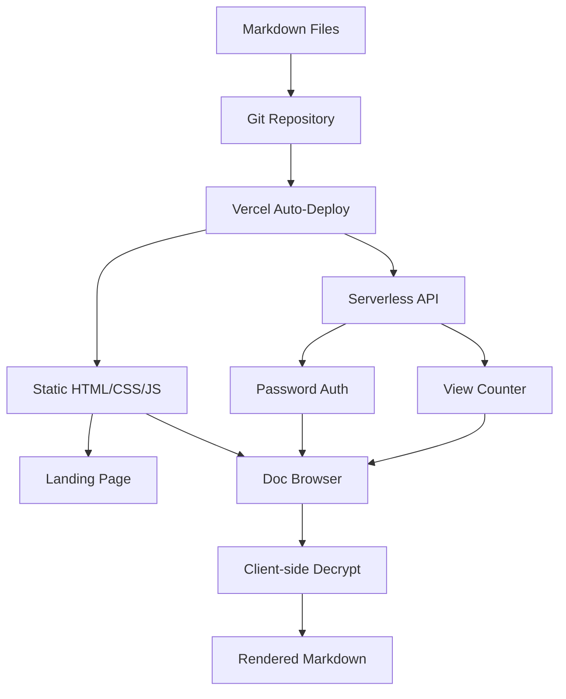
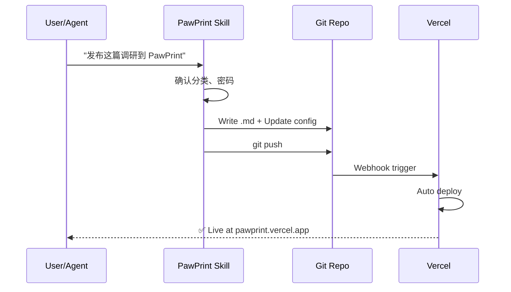
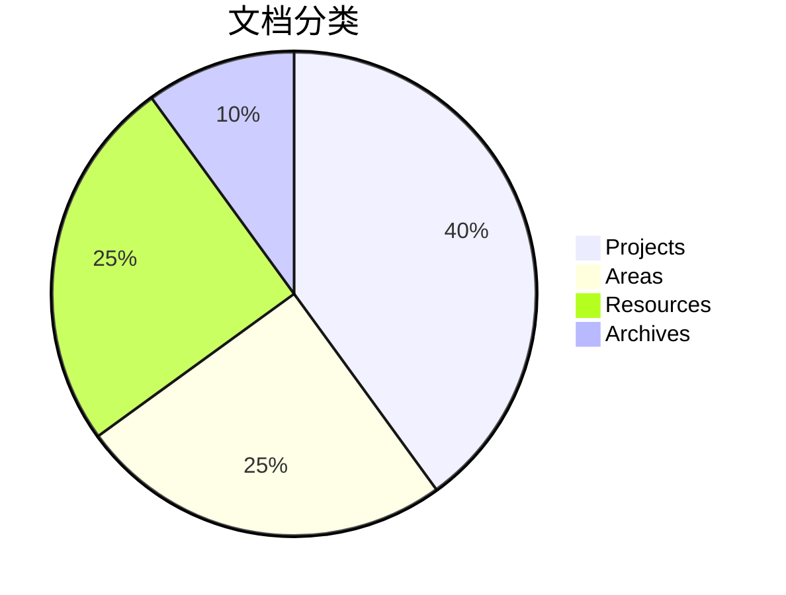

# PawPrint Feature Demo

> 这篇文档展示 PawPrint 的 Markdown 渲染能力。

## 代码语法高亮

### JavaScript

```javascript
// PawPrint publish workflow
async function publishDoc(slug, content, options = {}) {
  const config = await readConfig();
  const entry = {
    slug,
    category: options.category || 'resources',
    title: options.title || slug,
    encrypted: options.encrypted || false,
  };
  config.docs.push(entry);
  await writeConfig(config);
  await gitPush(`docs: add ${slug}`);
  return `https://pawprint-jayce.vercel.app/docs#${slug}`;
}
```

### Python

```python
import hashlib
import json

def generate_slug(title: str) -> str:
    """Convert title to URL-safe slug."""
    return title.lower().replace(" ", "-").strip("-")

class PawPrintClient:
    def __init__(self, repo_path: str):
        self.repo = repo_path
        self.config = self._load_config()

    def _load_config(self) -> dict:
        with open(f"{self.repo}/docs.config.json") as f:
            return json.load(f)

    def publish(self, title: str, content: str, category: str = "resources"):
        slug = generate_slug(title)
        filepath = f"docs/{category}/{slug}.md"
        with open(f"{self.repo}/{filepath}", "w") as f:
            f.write(content)
        print(f"✅ Published: {slug}")
```

### Bash

```bash
#!/bin/bash
# Quick publish script
SLUG="$1"
CATEGORY="${2:-resources}"

cd /tmp/clawme-docs
echo "# $SLUG" > "docs/$CATEGORY/$SLUG.md"
git add -A && git commit -m "docs: add $SLUG" && git push
echo "🐾 Published: $SLUG"
```

## Mermaid 图表

### PawPrint 架构



### 发布流程



### PARA 分类



## 表格

| Feature | PawPrint | Notion | Obsidian |
|---------|---------|--------|----------|
| AI Agent 发布 | ✅ | ❌ | ⚠️ |
| 独立密码 | ✅ | ❌ | ❌ |
| E2E 加密 | ✅ | ❌ | ❌ |
| 零数据库 | ✅ | ❌ | ✅ |
| 免费 | ✅ | ⚠️ | ⚠️ |

## 引用

> "当创造东西的成本趋近于零，信任就是最稀缺的资源。"

---

🐾 **PawPrint** — Leave your mark.
